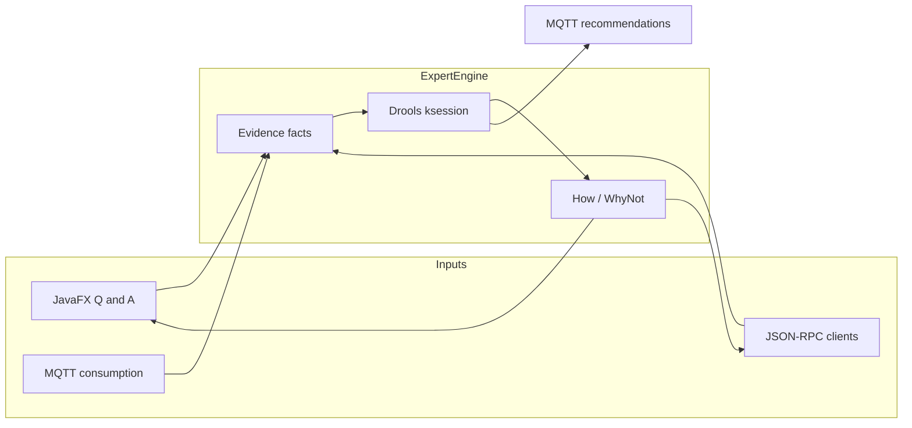

# Architecture

The application is a **rule-based expert system**: evidence facts go into a Drools working memory, rules insert deductions and conclusions, and a How tree explains which rule produced each conclusion.

## Packages

| Package | Role |
|---------|------|
| `org.engcia` | JavaFX `App` lifecycle, FXML helpers, static session pointers used by rules |
| `org.engcia.controller` | FXML controllers (`consumidor`, `primary`, `questions`) |
| `org.engcia.model` | Domain constants: questions, contracted-power tiers, solar panel size, appliance efficiency tables |
| `org.engcia.model.common` | Working-memory facts: `CategoricalEvidence`, `NumericalEvidence`, `Deduction`, `Conclusion` |
| `org.engcia.services` | `ExpertEngine`, `Calculate`, `How`, `WhyNot`, `EvidenceHelper` |
| `org.engcia.integration` | JSON-RPC HTTP server and MQTT bridge |
| `org.engcia.config` | `application.properties` + environment overrides |
| `org.engcia.view` | Legacy console UI (not used by the JavaFX flow) |

## Session lifecycle

1. User (or `setConsumer` RPC) selects consumer `1` or `2`.
2. `ExpertEngine.startConsumer` creates a Drools `ksession`, loads classpath JSON (`consumer{id}_max.json` and `consumer{id}_mean.json`), and inserts derived numerical facts (`Max Consumption`, `Best Contracted Power`, appliance peaks, …).
3. Live MQTT snapshots, if any, override those numbers.
4. Q&A inserts more evidence (`yes`/`no`, efficiency grades, contracted power, area, distance).
5. `recommend()` / **See Options** calls `fireAllRules()`. Conclusions are collected and explained with `How`.
6. Explanations are shown in the UI, returned by JSON-RPC, and published to MQTT.

There is **one engine session at a time**. Starting a new analysis or switching consumer disposes the previous KieSession.

## Fact types

- **CategoricalEvidence** — `description` + string `value` (tariff type, yes/no, efficiency).
- **NumericalEvidence** — `description` + `value` (kW, km, m²).
- **Deduction** — intermediate conclusion (e.g. “Install Solar Panel”).
- **Conclusion** — user-facing advice. Constructors register with `TrackingAgendaEventListener` so How can rebuild the proof.

`EvidenceHelper` always queries the **current** KieSession (not a stale snapshot).

## Rules (`src/main/resources/org/engcia/rules/rules.drl`)

| Rule | Rough meaning |
|------|----------------|
| `changeContract` | Contracted power ≠ recommended tier for peak load |
| `changeBiSchedule` / `-1` | Off-peak share high enough to switch to dual schedule |
| `installSolarPanel` + sell/no-sell | Willing to invest and has area → panel count and surplus |
| `switchNight-1/2` | Programmable appliance + bi-schedule → run at night |
| `switchLocomotion-*` | Distance bands → scooter / e-bike / EV |
| `payEletric` | Fast EV charge may require extra contracted power |
| `final-rule` | Willing to replace appliances → efficiency combo to drop a power tier |

KIE config: `src/main/resources/META-INF/kmodule.xml` (`ksession`).

## How / WhyNot

- **How** walks `Justification` records produced when rules fire (`TrackingAgendaEventListener`).
- **WhyNot** parses the DRL AST (`RuleUtils`) and is exposed over JSON-RPC (`whyNot`). It is not yet shown in the JavaFX window.

## UI flow

`consumidor.fxml` → consumer id → `primary.fxml` → **Start new Analysis** opens `questions.fxml` pop-ups until **See Options**, then `recommend()` and back to primary with the explanation text.
